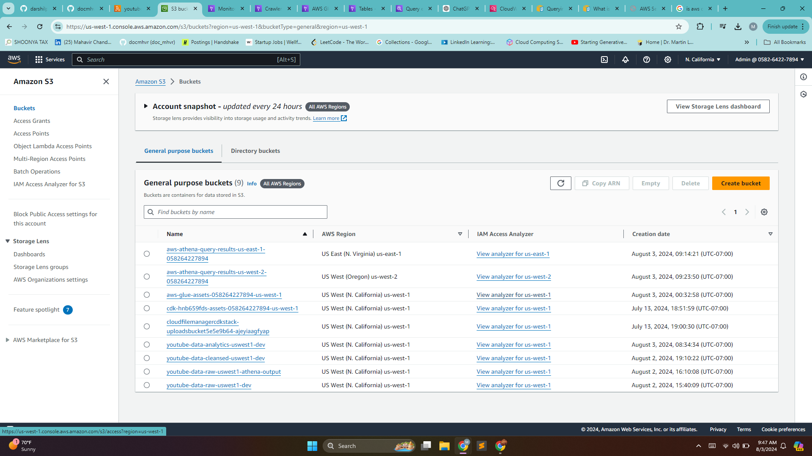
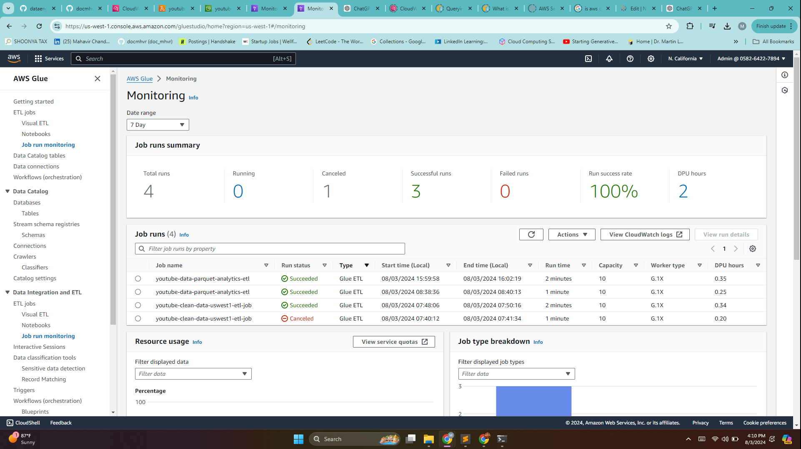
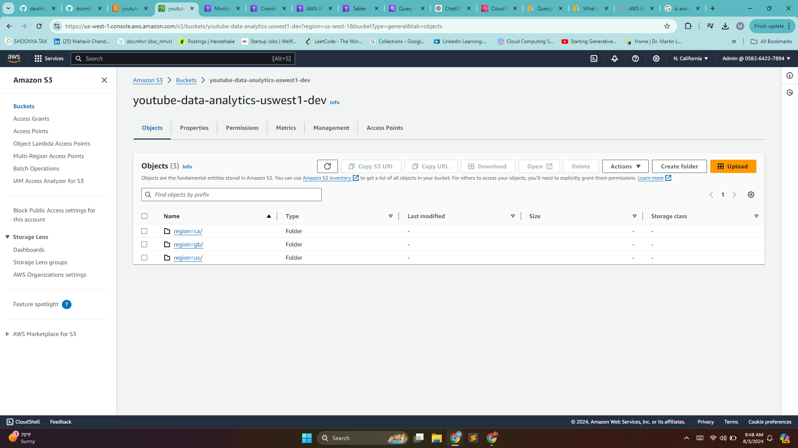
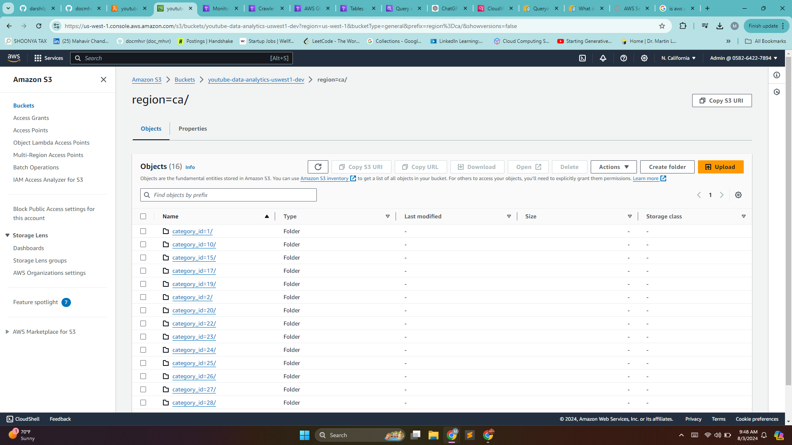
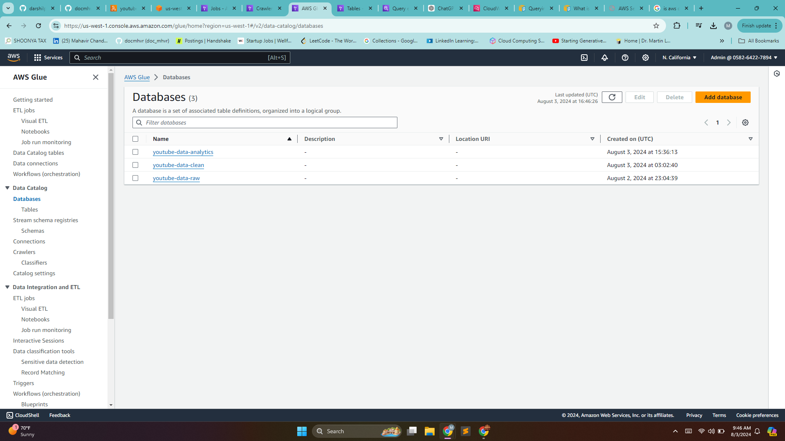
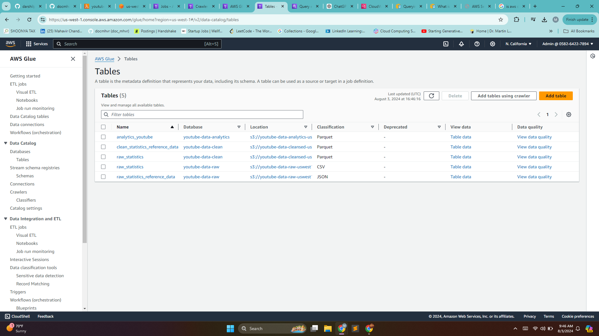

# Youtube Data Analytics

This repository contains the code and documentation for a project that performs data analytics on Youtube analytics data. The project involves setting up a data pipeline using AWS services to process, transform, and visualize Trending YouTube Video Statistics data. Data is sourced from the Kaggle dataset, "Trending YouTube Video Statistics," collected using the Trending YouTube Video Scraper that scrapes the most relevant information from videos that are currently trending on YouTube in a specified set of countries.

## Features

- **Data Ingestion**: Automated data ingestion from Kaggle and YouTube API.
- **AWS Integration**: Utilizes various AWS services like S3, Glue, Lambda, and Athena for data processing.
- **Data Preprocessing**: Cleans and transforms data using AWS Lambda functions.
- **ETL Pipeline**: Implements an ETL pipeline with AWS Glue for efficient data transformation and loading.
- **Data Storage**: Stores raw and cleaned data in S3 buckets.
- **Data Cataloging**: Uses AWS Glue to create data catalogs for easy querying.
- **Visualization**: Provides insights through visualizations using Quicksight and Tableau.

## Project Architecture


## Project Implementation

1. [Setup Project](#setup-project)
2. [Setup AWS](#setup-aws)
3. [Data Processing](#data-processing)
4. [ETL](#etl)
5. [Reporting and Visualization](#reporting-and-visualization)
6. [Documentation and Publishing](#documentation-and-publishing)

## Setup Project

### a. Project Directory

The project directory structure was created and a Python virtual environment was set up.

### b. Github Version Control

A Git repository was initialized and the initial project setup was committed.

```bash
git init
git add .
git commit -m "Initial project setup"
```

## Setup AWS

### a. Create IAM Role

An IAM role was created with the least privilege principle for accessing required AWS services.

### b. Setup AWS CLI

AWS CLI was configured with access key and secret key of the new IAM admin user.

```bash
aws configure
```

### c. Create S3 Bucket

An S3 bucket was created from the AWS console for storing raw data.

### Screenshot:



## Data Processing

### a. Download Raw Data

Raw data was downloaded from Kaggle and Youtube API crawler.

- [Kaggle Youtube Dataset](https://www.kaggle.com/datasets/datasnaek/youtube-new/data)
- [Youtube API Crawler](https://github.com/mitchelljy/Trending-YouTube-Scraper)

### b. Upload Raw Data to S3

Raw data was uploaded from the local directory to the S3 bucket.

```bash
aws s3 cp . s3://youtube-data-raw-uswest1-dev/youtube/raw_statistics_reference_data/ --recursive --exclude "*" --include "*.json"

aws s3 cp CAvideos.csv s3://youtube-data-raw-uswest1-dev/youtube/raw_statistics/region=ca/
aws s3 cp GBvideos.csv s3://youtube-data-raw-uswest1-dev/youtube/raw_statistics/region=gb/
aws s3 cp USvideos.csv s3://youtube-data-raw-uswest1-dev/youtube/raw_statistics/region=us/
```

### Screenshot:


### c. AWS Glue Crawler

An AWS Glue Crawler was created with S3 access to create a table in the database.

- Database name: `youtube-data-raw-uswest1-athena-output`
- Output S3 bucket: `youtube-data-raw`

### Screenshot:


### d. Data Preprocessing

Data was formatted correctly and preprocessed for the Glue Crawler.

### e. AWS Lambda Function

An AWS Lambda function was created to clean the data and store it back in the cleaned database and S3 bucket.

- Lambda function name: `youtube-data-uswest1-raw-json-to-parquet`
- A new Lambda service role was created with necessary permissions.
- Environment variables for the new database, table, and bucket were added.
- Lambda execution time was increased and a layer for dependencies (AWS Pandas, Data Wrangler) was added.

### Screenshot:


## ETL

### a. AWS Glue ETL Job

A Glue ETL job was created to extract data from the raw S3 bucket, transform it, and load it into the cleaned S3 bucket.

- An ETL PySpark script was implemented.
- Partition key was added as regions.
- The ETL job was run and a clean catalog database and table were created.

### Screenshot:




### b. Trigger S3-Lambda

A trigger was added to the Lambda function for input files on the raw S3 bucket.

### c. Data Joining

An ETL job was created to join the clean catalogs of `raw_statistics` and `raw_statistics_reference_data`.

- Glue Studio was used to create the job.
- Target: S3 bucket `youtube-data-analytics-uswest1-dev`.

### Screenshot:


### Screenshot:

Final output of Analytics/Reporting bucket




Final output tables and databases in AWS Glue Catalog




## Reporting and Visualization

### Tableau

All data from the `analytics_youtube` table was queried, downloaded as a CSV, and visualized in Tableau. Final csv in data folder in this repository.

- [Tableau Public Dashboard](https://public.tableau.com/views/)

### Screenshot:


## Documentation and Publishing

- The project was documented with screenshots.
- The visualizations were published on Tableau Public.